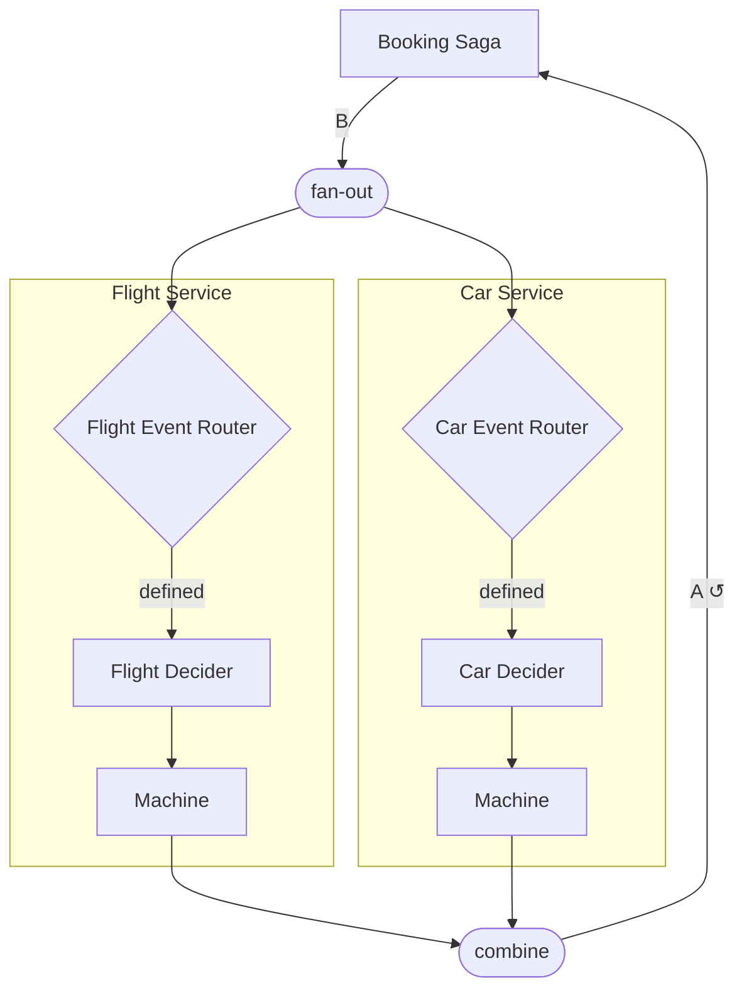

# Mermaid

`Mermaid` renders any `Apparatus` network as a [Mermaid](https://mermaid.js.org)
flowchart. Only the structural topology is shown — internal state and transition
functions are erased at runtime — but labels make a diagram easier to digest how the network is setup.

```scala
import apparatus.core.*
import cats.Id
import cats.implicits.*
```

## Basic usage

```scala
val diagram: String = Mermaid.print(myMachine)
```

Paste the result into [mermaid.live](https://mermaid.live) or drop it into a Markdown renderer
that supports Mermaid fenced code blocks.

## Attaching labels

Call `.label("…")` on any sub-machine before passing the network to `print`.

```scala
val labeled =
  bookingDecider.label("Booking Saga") <-> (
    flightService.label("Flight Service")
      merge carService.label("Car Service")
      merge hotelService.label("Hotel Service")
  )

val diagram = Mermaid.print(labeled)
```

Label semantics depend on what the node is:

| Expression | Effect in diagram |
|---|---|
| `basic.label("X")` | Renames the rectangle to `X` |
| `lmapOrEmpty{…}.label("X")` | Renames the filter diamond to `X` |
| `composite.label("X")` | Wraps the entire sub-graph in `subgraph "X"` |

## Shape legend

| Mermaid shape | Apparatus node |
|---|---|
| `["name"]` rectangle | `Apparatus.Basic` — a single machine |
| `{"name"}` diamond | `Apparatus.Alternative` (routing) or `Apparatus.LmapOrEmpty` (filter) |
| `(["name"])` stadium | Structural `split`, `join`, `fan-out`, `combine` connectors |

## Example output

For the booking saga network:



## Feedback back-edges

`Apparatus.Feedback` (`<->`) and `Apparatus.FeedbackMany` produce back-edges labelled `A ↺`
and `N[A] ↺` respectively. Mermaid renders these as curved arrows that close the loop visually.

## Labeling intermediate nodes

The most useful pattern is to label every `Basic` that wraps a domain decider and every
`lmapOrEmpty` filter:

```scala
def labeledFlightService(flight: Decider[FlightState, FlightCommand, List[FlightEvent]]) = {
  val flightDecider = Apparatus.Basic(flight.toBaseMachine[Id]).label("Flight Decider")
  val flightService = flightDecider
    .lmapOrEmpty[SagaEvent[BookingStep]] {
      case SagaEvent.StepStarted(BookingStep.Flight) => FlightCommand.Reserve
    }
    .label("Flight Event Router")
    .rmap(_.collect {
      case FlightEvent.Reserved => BookingCommand.MarkFlightComplete
    })

  flightService.label("Flight Service")
}
```
