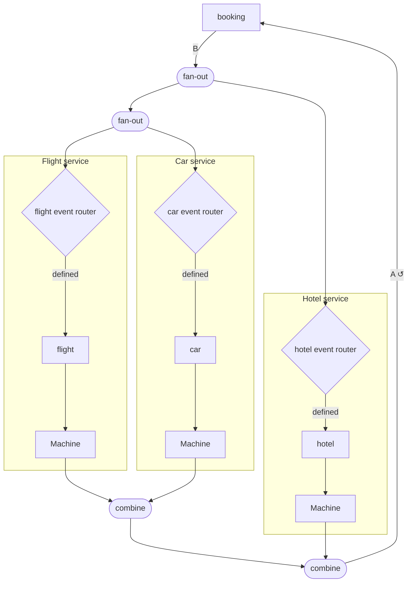

# Mermaid

`Mermaid` renders any `Apparatus` network as a [Mermaid](https://mermaid.js.org)
flowchart. Only the structural topology is shown — internal state and transition
functions are erased at runtime — but labels make a diagram easy to read.

```scala mdoc:silent
import apparatus.core.*
import apparatus.core.fix.alg.Mermaid
import apparatus.examples.*
import cats.Id
import cats.implicits.*
```

## Basic usage

```scala mdoc:silent
val diagram: String = Mermaid.print(saga[Id]())
```

Paste the result into [mermaid.live](https://mermaid.live) or drop it into a Markdown renderer
that supports Mermaid fenced code blocks. Alternatively call `.mermaid` as an extension method:

```scala mdoc:silent
val diagram2: String = saga[Id]().mermaid
```

## Attaching labels

Call `.label("…")` on any sub-machine before passing the network to `print`.
The booking saga example bakes labels into every service machine and the orchestrator,
so `saga()` produces a fully annotated network.

Label semantics depend on what the node is:

| Expression | Effect in diagram |
|---|---|
| `closedMealy(m).label("X")` | Renames the box to `X` |
| `lmapOrEmpty{…}.label("X")` | Renames the filter diamond to `X` |
| `composite.label("X")` | Wraps the entire sub-graph in `subgraph "X"` |

## Shape legend

| Mermaid shape | Apparatus node |
|---|---|
| `["name"]` rectangle | `aggregateMachine`, `closedMealy`, or `openMealy` — a single machine node |
| `{"name"}` diamond | `Alternative` (routing) or `LmapOrEmpty` (filter) |
| `(["name"])` stadium | Structural `split`, `join`, `fan-out`, `combine` connectors |

## Example output

`Mermaid.print(saga[Id]())` for the three-service booking saga:



## Feedback back-edges

`Apparatus.feedback` and `Apparatus.feedbackMany` produce back-edges labelled `A ↺` and
`N[A] ↺` respectively. Mermaid renders these as arrows that close the loop visually.

## Labeling intermediate nodes

The most useful pattern is to label every `aggregateMachine` node that wraps a domain
decider and every `lmapOrEmpty` filter. The `SagaStepAdapter.lmapOrEmpty` method does
this automatically, adding a `"<step> event router"` label.

Manual labeling:

```scala mdoc:silent
import apparatus.examples.*
import cats.effect.SyncIO
import java.util.UUID

val labeled: Apparatus[SyncIO, FlightCommand, List[FlightEvent]] =
  Apparatus
    .aggregateMachine[SyncIO, FlightCommand, FlightEvent](flightDecider(), _.id)
    .label("Flight Decider")
```
